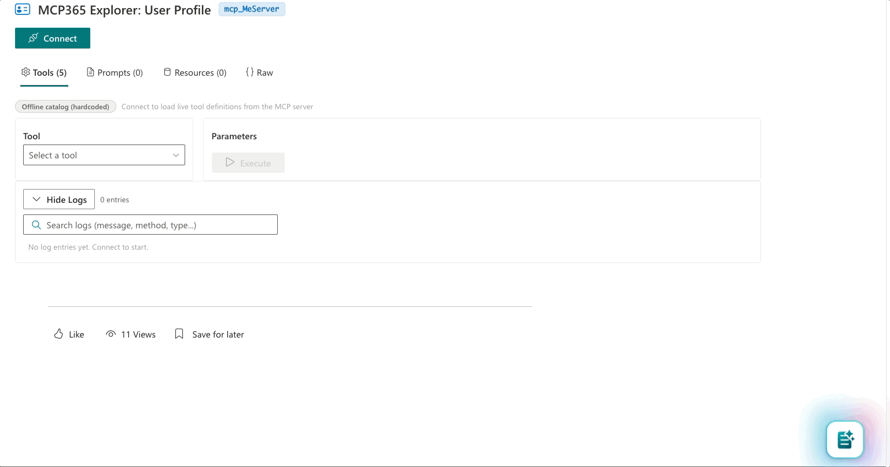

# MCP365 Explorer

## Compatibility


-Incompatible-red.svg "SharePoint Server 2016 Feature Pack 2 requires SPFx 1.1")


## Summary

Open-source SPFx webparts for exploring and testing the Microsoft 365 MCP servers ([Agents 365 Tools](https://learn.microsoft.com/en-us/microsoft-agent-365/tooling-servers-overview)). One webpart per server, each accompanied by a [blog post](https://www.puntobello.ch/en/nello/mcp365_explorer_intro/).

**Key finding:** You can call the Agent 365 MCP servers **directly from an SPFx webpart** — no backend, no Azure Functions proxy, no additional infrastructure. Just `fetch`, a bearer token from `AadTokenProvider`, and the JSON-RPC protocol.

> **Preview notice:** The Agents 365 Tools and MCP servers are part of the [Microsoft Agent 365 tooling servers preview](https://learn.microsoft.com/en-us/microsoft-agent-365/tooling-servers-overview). These features are in preview, may change, and should not be used in production workloads.

## Webparts

| Server | ID | Tools | Status |
|--------|-----|-------|--------|
| [User Profile](webparts/mcp365-user-profile/) | `mcp_MeServer` | 5 | Available |
| SharePoint Lists | `mcp_SharePointListsTools` | 13 | Coming soon |
| Outlook Calendar | `mcp_CalendarTools` | 13 | Coming soon |
| Outlook Mail | `mcp_MailTools` | 21 | Planned |
| SharePoint & OneDrive | `mcp_ODSPRemoteServer` | 17 | Planned |
| Teams | `mcp_TeamsServer` | 26 | Planned |
| Word | `mcp_WordServer` | 4 | Planned |

## What Each Webpart Does

- **Showcase mode** — click a button, see the result. No JSON, no parameters.
- **Explorer mode** — browse tools, inspect live schemas from `tools/list`, auto-generated parameter forms, formatted responses, searchable log viewer
- **Custom presets** — save your own parameter sets to browser localStorage



## Prerequisites

1. **Microsoft Frontier AI Program** — [Enrollment](https://adoption.microsoft.com/en-us/copilot/frontier-program/)
2. **Agent 365 Service Principal** — Run [`New-Agent365ToolsServicePrincipalProdPublic.ps1`](scripts/New-Agent365ServicePrincipal.ps1) (one-time admin operation). See [Microsoft's guide](https://learn.microsoft.com/en-us/microsoft-agent-365/developer/tooling#set-up-service-principal).
3. **Power Platform Environment ID** — From [Power Platform admin center](https://admin.powerplatform.microsoft.com/). See [how to find it](https://learn.microsoft.com/en-us/power-platform/admin/determine-org-id-name).
4. **Node.js 22+** and SPFx 1.22

Full setup details: [GriMoire prerequisites guide](https://grimoire-hie.github.io/docs/getting-started/prerequisites)

## Quick Start

```bash
cd webparts/mcp365-user-profile
npm install
npx heft build --clean

# Package for deployment
npx heft test --clean --production
npx heft package-solution --production
```

Upload the `.sppkg` from `sharepoint/solution/` to your app catalog, approve the API permission, and add the webpart to a page.

## Blog Series

- [MCP365 Explorer — A developer toolkit for Agents 365 Tools](https://www.puntobello.ch/en/nello/mcp365_explorer_intro/) (introduction + User Profile)
- More posts coming — one per server

## Resources

- [Agent 365 Tooling Servers Overview](https://learn.microsoft.com/en-us/microsoft-agent-365/tooling-servers-overview)
- [Model Context Protocol Specification](https://modelcontextprotocol.io/)
- [GriMoire — Visual AI Assistant for M365](https://grimoire-hie.github.io/)
- [SPFx Documentation](https://learn.microsoft.com/en-us/sharepoint/dev/spfx/sharepoint-framework-overview)
