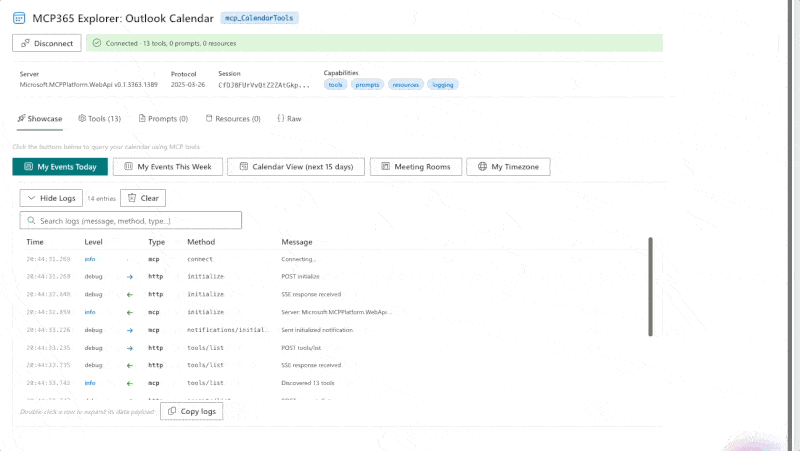

# MCP365 Explorer: Work IQ Calendar

Interactive SPFx webpart for exploring the **mcp_CalendarTools** — the Work IQ Calendar server with 13 tools for events, meetings, invitations, and availability.



## What it does

Connect directly to the Work IQ Calendar server from the browser — no backend required — and interactively explore all 13 tools:

- **Showcase**: My Events Today, This Week, Calendar View (next 15 days with recurring expansion), Meeting Rooms, My Timezone
- **Tools tab**: Browse all 13 tools, inspect live schemas, auto-generated parameter forms
- **Formatted responses**: Clean JSON, Graph noise stripped
- **Searchable log viewer**: Every JSON-RPC exchange with sorting and expand

## Prerequisites

1. **Agents Toolkit Preview** — tenant enrolled in the Microsoft 365 Agents Toolkit program
2. **Service Principal** — run `scripts/New-Agent365ServicePrincipal.ps1` (one-time admin operation)
3. **Environment ID** — Power Platform environment GUID
4. **Node.js 22+** and SPFx 1.22

## Build & Deploy

```bash
cd webparts/mcp365-calendar
npm install
npx heft build --clean
npx heft test --clean --production
npx heft package-solution --production
```

Upload `sharepoint/solution/mcp365-calendar.sppkg` to your app catalog, then approve the **McpServers.Calendar.All** permission in SharePoint admin center.

## Part of MCP365 Explorer

This is part of the [MCP365 Explorer](https://github.com/ferrarirosso/mcp365-explorer) series — one webpart per Work IQ MCP server, each with a matching [blog post](https://www.puntobello.ch/en/nello/mcp365_explorer_calendar/).
