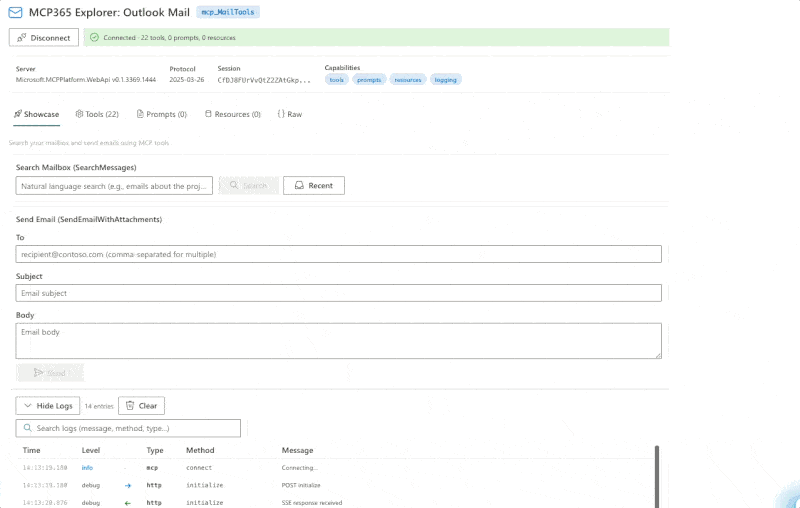
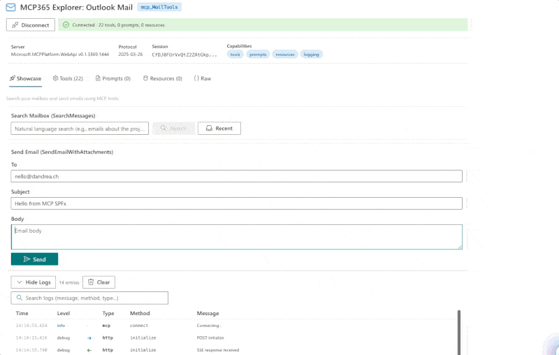

# MCP365 Explorer: Work IQ Mail

Interactive SPFx webpart for exploring the **mcp_MailTools** — the Work IQ Mail server with 22 tools for email search, drafts, sending, replying, forwarding, and attachments.



## What it does

Connect directly to the Work IQ Mail server from the browser — no backend required — and interactively explore all 22 tools:

- **Showcase**: Copilot-powered natural language mailbox search + Send Email form
- **Tools tab**: Browse all 22 tools, inspect live schemas, auto-generated parameter forms
- **Formatted responses**: Clean JSON, Graph noise stripped
- **Searchable log viewer**: Every JSON-RPC exchange with sorting and expand

## Key findings

`SearchMessages` is not a simple keyword filter — it's a **Copilot-powered semantic search** that takes natural language queries and returns structured markdown summaries with citations. Fundamentally different from Graph's `$filter` approach.

Sending an email is one call — no Graph SDK, no request builder chains:



## Prerequisites

1. **Agents Toolkit Preview** — tenant enrolled in the Microsoft 365 Agents Toolkit program
2. **Service Principal** — run `scripts/New-Agent365ServicePrincipal.ps1` (one-time admin operation)
3. **Environment ID** — Power Platform environment GUID
4. **Node.js 22+** and SPFx 1.22

## Build & Deploy

```bash
cd webparts/mcp365-mail
npm install
npx heft build --clean
npx heft test --clean --production
npx heft package-solution --production
```

Upload `sharepoint/solution/mcp365-mail.sppkg` to your app catalog, then approve the **McpServers.Mail.All** permission in SharePoint admin center.

## Part of MCP365 Explorer

This is part of the [MCP365 Explorer](https://github.com/ferrarirosso/mcp365-explorer) series — one webpart per Work IQ MCP server, each with a matching [blog post](https://www.puntobello.ch/en/nello/mcp365_explorer_mail/).
