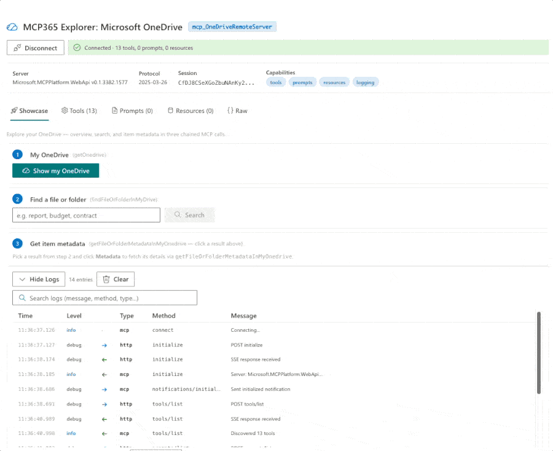

# MCP365 Explorer: Work IQ OneDrive

Interactive SPFx webpart for exploring the **mcp_OneDriveRemoteServer** — the new dedicated Work IQ OneDrive server with 13 tools for browsing, searching, reading, and managing files and folders in your personal OneDrive.



## What it does

Connect directly to the Work IQ OneDrive server from the browser — no backend required — and interactively explore all 13 tools:

- **Showcase**: Show my OneDrive (overview + quota) → Find files or folders → Get item metadata
- **Tools tab**: Browse all 13 tools, inspect live schemas, auto-generated parameter forms
- **Formatted responses**: Clean DriveItem JSON, Graph noise stripped
- **Searchable log viewer**: Every JSON-RPC exchange with sorting and expand

## Prerequisites

1. **Microsoft Frontier AI Program** — tenant enrolled
2. **Work IQ Tools Service Principal** — run `scripts/New-Agent365ServicePrincipal.ps1` (one-time admin operation)
3. **Environment ID** — Power Platform environment GUID
4. **Node.js 22+** and SPFx 1.22

## Build & Deploy

```bash
cd webparts/mcp365-onedrive
npm install
npx heft build --clean
npx heft test --clean --production
npx heft package-solution --production
```

Upload `sharepoint/solution/mcp365-onedrive.sppkg` to your app catalog, then approve the **McpServers.OneDrive.All** permission in SharePoint admin center.

## Part of MCP365 Explorer

This is part of the [MCP365 Explorer](https://github.com/ferrarirosso/mcp365-explorer) series — one webpart per Work IQ MCP server, each with a matching [blog post](https://www.puntobello.ch/en/nello/mcp365_explorer_onedrive/).
