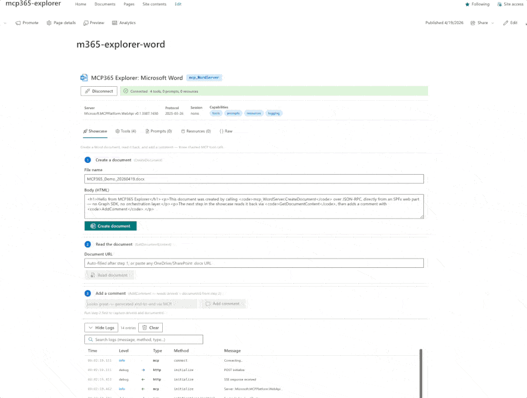

# MCP365 Explorer: Work IQ Word

Interactive SPFx webpart for exploring the **mcp_WordServer** — the Work IQ Word server with 4 tools for creating Word documents, reading their content, and annotating them with comments and replies, all from the browser.



## What it does

Connect directly to the Work IQ Word server from the browser — no backend required — and interactively exercise all 4 tools through a chained showcase:

- **Showcase**: Create a document → Read it back → Add a comment
- **Tools tab**: Browse all 4 tools, inspect live schemas, auto-generated parameter forms
- **Formatted responses**: Graph `DriveItem` JSON unwrapped and displayed cleanly
- **Searchable log viewer**: Every JSON-RPC exchange with sorting and expand

## Prerequisites

1. **Microsoft Frontier AI Program** — tenant enrolled
2. **Work IQ Tools Service Principal** — run `scripts/New-Agent365ServicePrincipal.ps1` (one-time admin operation)
3. **Environment ID** — Power Platform environment GUID
4. **Node.js 22+** and SPFx 1.22

## Build & Deploy

```bash
cd webparts/mcp365-word
npm install
npx heft build --clean
npx heft test --clean --production
npx heft package-solution --production
```

Upload `sharepoint/solution/mcp365-word.sppkg` to your app catalog, then approve the **McpServers.Word.All** permission in SharePoint admin center.

## Part of MCP365 Explorer

This is part of the [MCP365 Explorer](https://github.com/ferrarirosso/mcp365-explorer) series — one webpart per Work IQ MCP server, each with a matching [blog post](https://www.puntobello.ch/en/nello/mcp365_explorer_word/).
